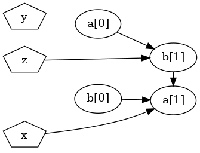

# What is sdtDBN?

This website contains an overview on the main sdtDBN functionalities.

tDBN is a Java program that creates a Dynamic Bayesian Network (DBN) from user multivariate longitudinal data, having polynomial time complexity in the number of attributes and observations. The complete implementation and functionalities of tDBN are publicly available [here](http://josemonteiro.github.io/tDBN/), being the Theorical background of tDBN explained in the following article:


>José L Monteiro, Susana Vinga, and Alexandra M Carvalho.
>Polynomial-time algorithm for learning optimal tree-augmented dynamic Bayesian networks.
>In UAI, pages 622–631, 2015. http://auai.org/uai2015/proceedings/papers/329.pdf


tDBN only allows learning a tDBN using dynamic data and does not allow to make inference on the created DBN. sdtDBN solves these issues, being an extension of tDBN to learn a DBN using both dynamic and static data and allowing the user to make inference on the learned DBN.

# Theoretical background of sdtDBN

sdtDBN was developed in the context of the Master's Thesis on Electrical and Computer Engineering of Tiago Leão, at Instituto Superior Técnico, Lisbon. The Thesis is available at **Aqui por ou link dps para a tese ou link para eventual artigo que se escreva**, in which all theorical background of sdtDBN is explained.

# Current release and libraries

## Current release

The program is currently in version 0.0.1 and can be downloaded [here](https://google.com). The program comes in an executable jar and its usage is explained and exemplified in this webpage.

## External libraries

Just as tDBN, the sdtDBN implementation uses two external libraries:

- [opencsv](http://opencsv.sourceforge.net/) (for parsing CSV files);

- [Apache Commons CLI](http://commons.apache.org/proper/commons-cli/) ( for parsing command line options)


# How to use the sdtDBN program?

## Program usage

The usage of the sdtDBN program can be found by running:

```
java -jar sdtDBN_v0.0.1.jar
```

Running the aforementioned command will produce the following usage of the program:

```
usage: tDBN
 -b,--numStaticParents <int>            Maximum number of static parents
                                        of a certain node (default = 2)
 -c,--compact                           Outputs network in compact format,
                                        omitting intra-slice edges. Only
                                        works if specified together with
                                        -d and with --markovLag 1.
 -d,--dotFormat                         Outputs network in dot format,
                                        allowing direct redirection into
                                        Graphviz to visualize the graph.
 -i,--inputFile <file>                  Input CSV file to be used for
                                        network learning.
 -inf,--inferenceFile <file>            File with variables to perform
                                        inference on
 -infFmt,--inferenceFormat <file>       Format to present inference. Can
                                        be mostProb or distrib, to give
                                        only the most probable value or
                                        the full distribution, for each
                                        attribute specified. Default is
                                        mostProb.
 -is,--inputStaticFile <file>           Input CSV file with static
                                        features to be used for network
                                        learning.
 -m,--markovLag <int>                   Maximum Markov lag to be
                                        considered, which is the longest
                                        distance between connected
                                        time-slices. Default is 1,
                                        allowing edges from one preceding
                                        slice.
 -ns,--nonStationary                    Learns a non-stationary network
                                        (one transition network per time
                                        transition). By default, a
                                        stationary DBN is learnt.
 -o,--outputFile <file>                 Writes output to <file>. If not
                                        supplied, output is written to
                                        terminal.
 -obs,--obsFile <file>                  File with the observations where
                                        inference should be done
 -obsStatic,--obsStaticFile <file>      File with the static observations
                                        to make inference
 -outInf,--outputInferenceFile <file>   File to write the inference
                                        performed
 -p,--numParents <int>                  Maximum number of parents from
                                        preceding time-slice(s).
 -pm,--parameters                       Learns and outputs the network
                                        parameters.
 -r,--root <int>                        Root node of the intra-slice tree.
                                        By default, root is arbitrary.
 -s,--scoringFunction <arg>             Scoring function to be used,
                                        either MDL or LL. MDL is used by
                                        default.
 -sp,--spanning                         Forces intra-slice connectivity to
                                        be a tree instead of a forest,
                                        eventually producing a structure
                                        with a lower score.
 -t,--trajectory <int>                  Timestep until which trajectory is
                                        to be determined
 -tf,--outputTrajectoryFile <file>      Writes predicted trajectories to
                                        <file>. If not supplied, output is
                                        written to terminal.
```

The arguments of the previous usage concern all the arguments of the original tDBN program plus the new arguments of sdtDBN, for learning DBNs also with static attribute and to make inference in the learned DBN.

Therefore, in this webpage it is described the usage of the following input arguments:
```
usage: tDBN
 -b,--numStaticParents <int>            Maximum number of static parents
                                        of a certain node (default = 2)
 -inf,--inferenceFile <file>            File with variables to perform
                                        inference on
 -infFmt,--inferenceFormat <file>       Format to present inference. Can
                                        be mostProb or distrib, to give
                                        only the most probable value or
                                        the full distribution, for each
                                        attribute specified. Default is
                                        mostProb.
 -is,--inputStaticFile <file>           Input CSV file with static
                                        features to be used for network
                                        learning.
 -obs,--obsFile <file>                  File with the observations where
                                        inference should be done
 -obsStatic,--obsStaticFile <file>      File with the static observations
                                        to make inference
 -outInf,--outputInferenceFile <file>   File to write the inference
                                        performed
 -t,--trajectory <int>                  Timestep until which trajectory is
                                        to be determined
 -tf,--outputTrajectoryFile <file>      Writes predicted trajectories to
                                        <file>. If not supplied, output is
                                        written to terminal.
```

The usage for the arguments not in this list should be checked at the [tDBN webpage](http://josemonteiro.github.io/tDBN/).

## Input files formats

All input files must be given in comma-separated values (CSV) format.

### Files with dynamic attributes

All files with dynamic attributes should follow the following format:

- The first line should be the header, where the first value must be some identification tag and the remaining values should be each attribute name together with the proper timestep, in the form "attName__timestep"
  
- The order of the attributes and timesteps must conform to the following:
  - Each timestep must have all its attributes in consecutive positions
  - The order of the attributes must be the same in all timesteps
  - Example for two attributes and two timesteps: attNameX__0, attNameY__0, attNameX__1, attNameY__1

- In each of the remaining lines, the first position should be the subject identifier and the remaining positions must be the values of the attributes in the respective timesteps, in the order defined in the header line

- Missing values should be marked either by not writing anything or by putting "?"

- An example file with dynamic attributes is presented next. In this file, there are 2 attributes and 3 timesteps. There are missing values at subject 20 in "attX__2" and at subject 21 in "attY__1"

```
id,attX__0,attY__0,attX__1,attY__1,attX__2,attY__2
20,3,-1,8,0,?,3
21,4,2,3,,2,-8
```

#### Arguments that use dynamic attributes

- **-i**: This argument should be the file with the dynamic observations used to learn the DBN;

- **-obs**: This argument should be the file with dynamic observations of the subjects in which inference is going to be made.


### Files with static attributes

All files with static attributes should follow the following format:

- The first line should be the header, where the first value must be some identification tag and the remaining values should be each attribute name.
  - It is important for the user to guarantee that a subject in the static file exists in the dynamic file (with the same id).
    - Subjects in **-is** file should exist in **-i** file.
    - Subjects in **-obsStatic** file should exist in **-obs**.
    - There may be subjects on the dynamic files not in the respective static files, but the opposite cannot be true!

- In each of the remaining lines, the first position should be the subject identifier and the remaining positions must be the values of the static attributes, in the order defined in the header line

- Missing values should be marked either by not writing anything or by putting "?"

- An example file with static attributes is presented next. In this file, there are 4 attributes. There are missing values at subject 20 in "attC" and at subject 21 in "attW"

```
id,attA,attC,attD,attW
20,A,,e,0
21,B,2,4,?
```

#### Arguments that use static attributes

- **-is**: This argument should be the file with the static observations used to learn the DBN. If not given, program will learn a tDBN, without static features. If given, program will learn a sdtDBN, with static and dynamic features;

- **-obsStatic**: This argument should be the file with static observations of the subjects in which inference is going to be made.

### File with variables and respective timesteps to make inference

The file with static attributes should follow the following format:

- There must be two values per line, separated by ","
  - The first value should be the dynamic attribute name
  - The second value should be the timestep

- All attributes names specified in this file must exist in the dynamic attributes files. The timesteps may not exist in the dynamic attributes files, in that case values will be predicted until the specified timestep, according to the learned network structure.

- An example file where the program would do inference for attX\[2\] and attY\[3\] is presented next.

```
attX,2
attY,3
```

#### Argument with variables and respective timesteps to make inference

- **-inf**: This argument should be the file with variables and respective timesteps to make inference.

## Illustrative examples

### Example 1 - Learning a DBN with dynamic and static attributes

This example focus only on the learning component of the program, introducing how to learn a DBN also with static attributes. 

The files used for this example are the following:

- [example1_dynamic](example1_dynamic.csv): The file with dynamic attributes for learning
- [example1_static](example1_static.csv): The file with static attributes for learning

To learn a sdtDBN with markovLag = 1, a maximum of 1 dynamic parent from the previous timeslice and a maximum of 1 static parent, the following command can be run:

```
java -jar tdbn.jar -i example1_dynamic.csv -is example1_static.csv -p 1 -s ll -m 1 -b 1
```

The output obtained is:

```
Evaluating network with LL score.
Number of networks with max score: 18
Finding a maximum branching.
Network score: -2.772588722239781

-----------------

b[0] -> a[1]
a[0] -> b[1]

b[1] -> a[1]

x -> a[1]
z -> b[1]
```

To obtain a graphical representation, the argument "-d" can be used, just as in the tDBN framework, as illustrated next:

```
java -jar tdbn.jar -i example1_dynamic.csv -is example1_static.csv -p 1 -s ll -m 1 -b 1 -d | dot -Tpng -o fig_example1.png
```

would output the following graph:




To learn the parameters of the created DBN, the argument -pm can be used:

```
java -jar tdbn.jar -i example1_dynamic.csv -is example1_static.csv -p 1 -s ll -m 1 -b 1 -pm
```

would obtain:


```
Evaluating network with LL score.
Number of networks with max score: 18
Finding a maximum branching.
Network score: -2.772588722239781

-----------------

b[0] -> a[1]
a[0] -> b[1]

b[1] -> a[1]

x -> a[1]
z -> b[1]


a: [0.0, 1.0]
[x=1.0, b[0]=0.0, b[1]=0.0]: 1.000 0.000
[x=0.0, b[0]=0.0, b[1]=0.0]: 0.000 1.000
[x=1.0, b[0]=1.0, b[1]=0.0]: 0.000 1.000
[x=1.0, b[0]=0.0, b[1]=1.0]: 0.500 0.500
[x=0.0, b[0]=1.0, b[1]=0.0]: 1.000 0.000
[x=0.0, b[0]=0.0, b[1]=1.0]: 1.000 0.000
[x=1.0, b[0]=1.0, b[1]=1.0]: 0.500 0.500
[x=0.0, b[0]=1.0, b[1]=1.0]: 0.000 1.000

b: [0.0, 1.0]
[z=1.0, a[0]=0.0]: 0.000 1.000
[z=0.0, a[0]=1.0]: 1.000 0.000
[z=0.0, a[0]=0.0]: 1.000 0.000
[z=1.0, a[0]=1.0]: 0.500 0.500
```

### Example 2 - Inference of specific attributes on a learned DBN with dynamic and static attributes

Following the DBN learned in example 1, inference can be made in that DBN. In this example, it is explained how to do inference on a specific attribute at a specific timestep.

The files used for this example are the following:

- [example1_dynamic](example1_dynamic.csv): The file with dynamic attributes for learning
- [example1_static](example1_static.csv): The file with static attributes for learning
- [example2_dynamic_inf](example2_dynamic_inf.csv): The file with the dynamic observations of the subjects where inference is to be made
- [example2_static_inf](example2_static_inf.csv): The file with the static observations of the subjects where inference is to be made
- [example2_infVars](example2_infVars.csv): The file with the dynamic attributes and respective timesteps where the user desires to make inference for the given subjects

When making inference, one of two options can be selected with the argument **-infFmt**:

- **-infFmt mostProb**: This mode will present, for each attribute\[timestep\] where inference was defined (file example2_dynamic_inf), the most probable value for each subject specified (files example2_static_inf and example2_infVars).

- **-infFmt distrib**: This mode will present, for each attribute\[timestep\] where inference was defined (file example2_dynamic_inf), the conditional distribution of the learned network, for each subject specified (files example2_static_inf and example2_infVars).

If there are cases where inference is not possible because the parent nodes values are not given in the observations files and cannot be determined by the model, the program will inform that inference is not possible on those specific cases.

If specifying **-infFmt mostProb**, the following command line should be inserted:

```
java -jar tdbn.jar -i example1_dynamic.csv -is example1_static.csv -p 1 -s ll -m 1 -b 1 -obs example2_dynamic_inf.csv -obsStatic example2_static_inf.csv -inf example2_infVars.csv -infFmt mostProb
```

getting the following output:

```
Evaluating network with LL score.
Number of networks with max score: 18
Finding a maximum branching.
Network score: -2.772588722239781

-----------------

b[0] -> a[1]
a[0] -> b[1]

b[1] -> a[1]

x -> a[1]
z -> b[1]


id,a[1],a[3],b[4],b[1]
1,0.0,0.0,1.0,1.0
2,0.0,0.0,0.0,0.0
3,null,0.0,1.0,1.0
```

If specifying **-infFmt distrib**, the following command line should be inserted:

```
java -jar tdbn.jar -i example1_dynamic.csv -is example1_static.csv -p 1 -s ll -m 1 -b 1 -obs example2_dynamic_inf.csv -obsStatic example2_static_inf.csv -inf example2_infVars.csv -infFmt distrib
```

getting the following output:

```
Evaluating network with LL score.
Number of networks with max score: 18
Finding a maximum branching.
Network score: -2.772588722239781

-----------------

b[0] -> a[1]
a[0] -> b[1]

b[1] -> a[1]

x -> a[1]
z -> b[1]


Distributions a[1]:
id,0.0,1.0
1,1.000,0.000
2,1.000,0.000
3,-1,-1

Distributions a[3]:
id,0.0,1.0
1,0.500,0.500
2,1.000,0.000
3,0.500,0.500

Distributions b[4]:
id,0.0,1.0
1,0.000,1.000
2,1.000,0.000
3,0.000,1.000
```

If wanting the output of the inference to written to a specific file, the user only needs to give the file to be created in the **-outInf** argument. For example:

```
java -jar tdbn.jar -i example1_dynamic.csv -is example1_static.csv -p 1 -s ll -m 1 -b 1 -obs example2_dynamic_inf.csv -obsStatic example2_static_inf.csv -inf example2_infVars.csv -infFmt distrib -outInf outputExample.csv
```

would write the previous inference output to the newly created file outputExample.csv.


### Example 3 - Getting the most probable trajectory


Por exemplo

<!---
# Program Eficiency

Talvez meter aqui algumas experiencias com datasets grandes e a variar o numero de pais estaticos

# References

Meter algumas referencias bibliograficas?

1. Numbered
2. List

**Bold** and _Italic_ and `Code` text

[Link](url) and 
-->
